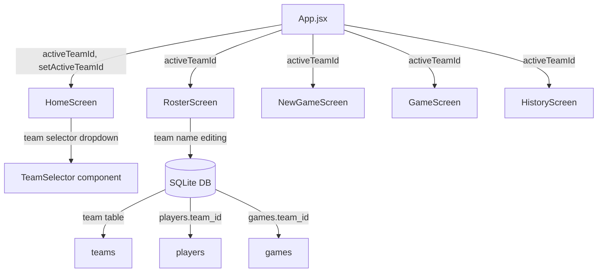
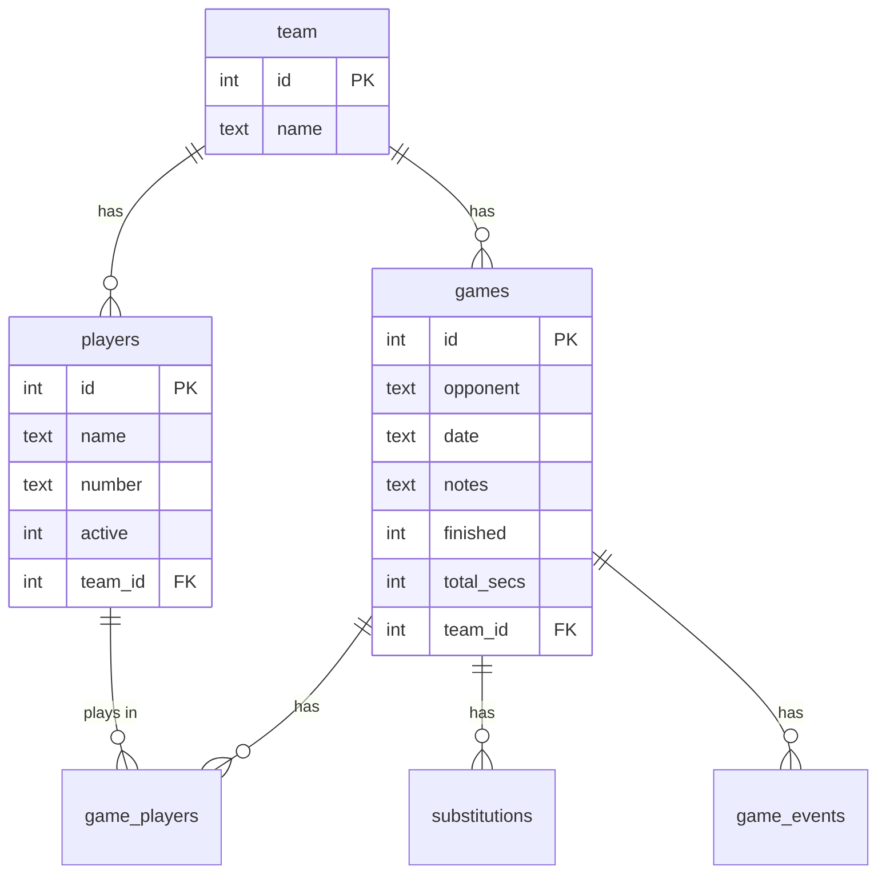

# Design Document: Multi-Team Rosters

## Overview

SubTracker currently operates with a single implicit team — one roster, one team name, one pool of games. This design introduces multi-team support so a single user (coach, scorekeeper, rec-league coordinator) can maintain independent rosters and game histories for multiple teams.

The core change is introducing a `team_id` foreign key on `players` and `games`, adding a team selector to the Home screen, and scoping all queries throughout the app to the active team. Since the product has not launched (no existing users), no data migration is needed — the schema is updated in place.

### Key Design Decisions

1. **Team ID on existing tables** — Rather than junction tables, we add a direct `team_id` FK to `players` and `games`. This is simpler and matches the 1:N relationship (a player belongs to exactly one team, a game belongs to exactly one team).
2. **Active team in localStorage** — The selected team ID is persisted in a separate localStorage key (`subtracker_active_team`), not in the SQLite DB, to avoid a DB read just to determine which team to load.
3. **Default team on first launch** — The existing `INSERT OR IGNORE INTO team (id, name) VALUES (1, 'My Team')` seed row is kept, ensuring there's always at least one team.
4. **Team selector as a dropdown overlay** — A tappable team name in the header opens a dropdown list of teams with an "Add Team" action. This avoids adding a new screen and keeps navigation minimal.
5. **Cascade deletes via application code** — sql.js doesn't enforce FK constraints by default, and enabling them adds complexity. Deletes will explicitly remove child rows (players, games, game_players, substitutions, game_events) in a transaction.

## Architecture

The app remains a single-page React application with state-driven navigation. The primary architectural change is threading `activeTeamId` through the component tree.



### State Flow

1. `App.jsx` loads the DB, reads `activeTeamId` from localStorage (falling back to team id 1).
2. `activeTeamId` is passed as a prop to every screen component.
3. All DB queries in screens add `WHERE team_id = ?` filtering.
4. When the user switches teams via the selector, `App.jsx` updates state and persists to localStorage.

## Components and Interfaces

### New Component: TeamSelector

A dropdown overlay triggered by tapping the team name in the HomeScreen header.

```jsx
// Props
{
  db: Database,           // sql.js database instance
  activeTeamId: number,   // currently selected team ID
  onSelect: (teamId: number) => void,  // called when user picks a team
  onTeamCreated: (teamId: number) => void, // called after new team is created
}
```

**Behavior:**
- Renders a list of all teams from `SELECT id, name FROM team ORDER BY id`
- Highlights the active team
- Has an inline "Add Team" row with a text input
- Validates non-empty team name before creation
- Calls `onTeamCreated` after insert, which also triggers `onSelect`

### Modified Components

**App.jsx**
- New state: `activeTeamId` (initialized from localStorage, default 1)
- New callback: `setActiveTeam(id)` — updates state + localStorage
- Passes `activeTeamId` to all screen components
- `resumeGame` query unchanged (game_players join doesn't need team filtering since game ID is already specific)

**HomeScreen**
- Receives `activeTeamId`, `onTeamChange` props
- Header shows team name (tappable to open TeamSelector)
- Queries scoped: `WHERE team_id = ? AND finished = 0` for in-progress, `WHERE team_id = ? AND finished = 1` for recent
- Renders TeamSelector overlay when team name is tapped

**RosterScreen**
- Receives `activeTeamId` prop
- Team name query: `SELECT name FROM team WHERE id = ?` (parameterized by activeTeamId)
- Player queries: `WHERE team_id = ?`
- Add player: `INSERT INTO players (name, number, active, team_id) VALUES (?, ?, 1, ?)`
- Save team name: `UPDATE team SET name = ? WHERE id = ?`
- Delete team action added (with confirmation, cascade delete, fallback to default team)

**NewGameScreen**
- Receives `activeTeamId` prop
- Player query: `WHERE active = 1 AND team_id = ?`
- Game insert: includes `team_id` column
- Team name display: `WHERE id = ?` parameterized

**HistoryScreen**
- Receives `activeTeamId` prop
- Games query: `WHERE team_id = ? ORDER BY id DESC`
- Delete game logic unchanged (already scoped by game ID)

**GameScreen**
- No changes needed — already scoped by `gameId` which inherently belongs to one team

## Data Models

### Schema Changes

```sql
-- Team table (already exists, no structural change)
CREATE TABLE IF NOT EXISTS team (
  id      INTEGER PRIMARY KEY,
  name    TEXT NOT NULL DEFAULT 'My Team'
);
INSERT OR IGNORE INTO team (id, name) VALUES (1, 'My Team');

-- Players: add team_id column
CREATE TABLE IF NOT EXISTS players (
  id      INTEGER PRIMARY KEY AUTOINCREMENT,
  name    TEXT NOT NULL,
  number  TEXT NOT NULL DEFAULT '',
  active  INTEGER NOT NULL DEFAULT 1,
  team_id INTEGER NOT NULL DEFAULT 1 REFERENCES team(id)
);

-- Games: add team_id column
CREATE TABLE IF NOT EXISTS games (
  id          INTEGER PRIMARY KEY AUTOINCREMENT,
  opponent    TEXT NOT NULL DEFAULT 'Opponent',
  date        TEXT NOT NULL,
  notes       TEXT DEFAULT '',
  finished    INTEGER NOT NULL DEFAULT 0,
  total_secs  INTEGER NOT NULL DEFAULT 0,
  team_id     INTEGER NOT NULL DEFAULT 1 REFERENCES team(id)
);

-- game_players, substitutions, game_events: unchanged
-- (they reference games.id / players.id, which are already team-scoped)
```

### Adding Columns to Existing Tables

Since there are no existing users, the schema in `applySchema()` is simply updated with the new columns in the `CREATE TABLE IF NOT EXISTS` statements. The `DEFAULT 1` ensures the seed team (id=1) is the implicit owner of any rows created before multi-team support.

For safety, `applySchema` will also run:
```sql
ALTER TABLE players ADD COLUMN team_id INTEGER NOT NULL DEFAULT 1 REFERENCES team(id);
ALTER TABLE games ADD COLUMN team_id INTEGER NOT NULL DEFAULT 1 REFERENCES team(id);
```
These are wrapped in try/catch since `ALTER TABLE ADD COLUMN` fails if the column already exists (which is fine — it means the schema is already up to date).

### localStorage Keys

| Key | Purpose |
|---|---|
| `bball_subtracker_db` | Base64-encoded SQLite database (existing) |
| `subtracker_active_team` | Integer team ID of the last selected team (new) |
| `subtracker-theme` | Theme preference (existing, unchanged) |

### Entity Relationships




## Correctness Properties

*A property is a characteristic or behavior that should hold true across all valid executions of a system — essentially, a formal statement about what the system should do. Properties serve as the bridge between human-readable specifications and machine-verifiable correctness guarantees.*

### Property 1: Team creation round-trip

*For any* non-empty, non-whitespace-only team name string, creating a team with that name should result in a team row existing in the database with that exact name, and the newly created team should become the active team.

**Validates: Requirements 1.2, 1.3**

### Property 2: Whitespace team names are rejected

*For any* string composed entirely of whitespace characters (including the empty string), attempting to create a team should be rejected, and the total number of teams in the database should remain unchanged.

**Validates: Requirements 1.4**

### Property 3: Active team selection persistence round-trip

*For any* set of teams and any team selected from that set, persisting the active team ID to localStorage and reading it back should return the same team ID.

**Validates: Requirements 2.3, 2.5**

### Property 4: Games are scoped to the active team

*For any* set of teams each with their own games, querying games for a given team ID should return only games whose `team_id` matches that ID, and no games belonging to other teams should appear.

**Validates: Requirements 2.4, 4.3, 4.4**

### Property 5: Players are scoped to the active team

*For any* set of teams each with their own players, querying players for a given team ID should return only players whose `team_id` matches that ID. When additionally filtering by `active = 1`, only active players from that team should appear.

**Validates: Requirements 3.1, 4.2, 7.2**

### Property 6: New player is associated with the active team

*For any* active team and any valid player name, adding a player should create a player record with `team_id` equal to the active team's ID, and the player should appear in that team's roster query but not in any other team's roster query.

**Validates: Requirements 3.2**

### Property 7: New game is associated with the active team

*For any* active team, creating a game should produce a game record with `team_id` equal to the active team's ID, and the game should appear in that team's game listing but not in any other team's game listing.

**Validates: Requirements 4.1**

### Property 8: Player edits are isolated to the target player and team

*For any* player edit operation (name change, number change, or active status toggle), only the targeted player record should be modified. All other players — both within the same team and on different teams — should remain unchanged.

**Validates: Requirements 3.3, 7.1**

### Property 9: Team rename round-trip

*For any* team and any new non-empty name, updating the team name and then querying the team by ID should return the new name.

**Validates: Requirements 5.1, 5.2**

### Property 10: Cascade delete removes team and all children

*For any* team that has players and games (with game_players, substitutions, and game_events), deleting that team should remove the team row, all its player rows, all its game rows, and all associated game_players, substitutions, and game_events rows. No orphaned child records should remain.

**Validates: Requirements 6.2**

### Property 11: Deleting the active team falls back to another team

*For any* scenario where at least two teams exist and the active team is deleted, the active team should be set to one of the remaining teams (i.e., the active team ID should reference a team that still exists in the database).

**Validates: Requirements 6.3**

## Error Handling

| Scenario | Handling |
|---|---|
| Empty/whitespace team name submitted | Prevent creation, show inline validation message, keep form open |
| Active team ID in localStorage references a deleted team | Fall back to the first team in `SELECT id FROM team ORDER BY id LIMIT 1`; if no teams exist, create default "My Team" |
| `ALTER TABLE ADD COLUMN` fails (column already exists) | Catch and ignore — this is expected on subsequent loads |
| Team deletion with cascade fails mid-transaction | Wrap all deletes in a single `db.run()` batch or sequential calls with a final `saveDb()`; if any step throws, the DB state from the last `saveDb()` is preserved in localStorage |
| localStorage quota exceeded on `saveDb()` | Existing behavior — no change. The app already doesn't handle this gracefully (known limitation) |
| sql.js CDN fails to load | Existing error screen shown — no change needed |
| Deleting the last team | Prevented by disabling the delete button when only one team exists. As a safety net, if somehow triggered, auto-create default "My Team" team |

## Testing Strategy

### Unit Tests (Playwright E2E)

The existing Playwright test infrastructure will be extended with team-aware helpers. Unit-level E2E tests should cover:

- Creating a team via the UI and verifying it appears in the selector
- Switching teams and verifying the home screen updates
- Adding players to different teams and verifying roster isolation
- Starting a game on one team and verifying it doesn't appear on another team's home/history
- Renaming a team and verifying the name updates across screens
- Deleting a team and verifying cascade removal + fallback behavior
- Edge case: attempting to create a team with an empty/whitespace name

### Property-Based Tests (fast-check)

Property-based tests will use [fast-check](https://github.com/dubzzz/fast-check) to verify the correctness properties above at the data layer (direct sql.js operations, no UI). This tests the DB logic in isolation.

**Library:** `fast-check` (npm package)

**Configuration:**
- Minimum 100 iterations per property test
- Each test tagged with a comment referencing the design property

**Tag format:** `Feature: multi-team-rosters, Property {number}: {property_text}`

**Test structure:**
- Tests will import `sql.js` directly (Node.js compatible WASM build) and use the same `applySchema`, `dbAll`, `dbGet`, `dbRun` helpers from `db.js`
- Generators will produce random team names, player names, jersey numbers, and game data
- Each property from the Correctness Properties section maps to exactly one `fc.assert(fc.property(...))` call

**Property test file:** `subtime-app/tests/multi-team-properties.test.js`

| Property | Test Approach |
|---|---|
| P1: Team creation round-trip | Generate random non-empty strings, create team, query back, assert name matches and active team updated |
| P2: Whitespace rejection | Generate whitespace-only strings, attempt creation, assert team count unchanged |
| P3: Active team persistence | Generate team IDs, write to localStorage mock, read back, assert equality |
| P4: Games scoped to team | Generate N teams with M random games each, query per team, assert all returned games have correct team_id |
| P5: Players scoped to team | Generate N teams with random players (mixed active/inactive), query per team, assert filtering correctness |
| P6: New player association | Generate team + player, insert, assert team_id matches and player absent from other teams |
| P7: New game association | Generate team + game, insert, assert team_id matches and game absent from other teams |
| P8: Player edit isolation | Generate multiple teams with players, edit one player, assert all others unchanged |
| P9: Team rename round-trip | Generate team + new name, update, query, assert new name returned |
| P10: Cascade delete | Generate team with full child hierarchy, delete team, assert zero rows remain for that team across all tables |
| P11: Active team fallback | Generate 2+ teams, delete the active one, assert new active team exists in remaining set |
